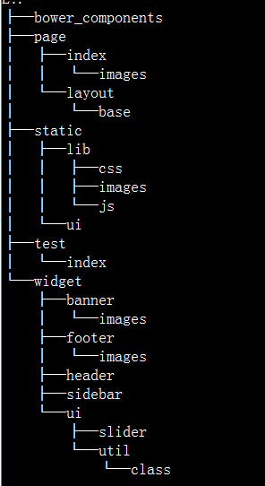

# 基于jello的通用子系统开发说明

## 目录结构

<!--  -->

* layout
	* 通用的模板输出，各个page只需要自定义相关的内容，然后继承layout模板即可
	* 这样各个page下的模板不需要去重复的定义html等结构，以及引入的类库等
	* 开发时只需要关心自己的业务功能

* page
	* page下可以新建多个目录，每个目录对应的就是一个页面
	* 每个页面下可以定义该页面所需资源，如新建首页，可以新增index.html、index.js、index.css、images
	* 各个页面下公用的部分可以组件化后放在widget目录

* static
	* static目录用于维护非模块化的静态资源
	* 存放公用的一些费模块css、js文件以及图片等资源

* test
	* 存放各个模板页面测试时候需要模拟的数据
	* 目录结构和page下类似
	* 如写好某个插件后，需要模拟接口数据，可在此目录下新增数据文件

* widget
	* 存放模块化资源 
	* 这里的模块化分为两个部分
		* 模板间公用的模块化组件，可直接新建 （业务层）
		* js和css的模块化资源建议放到widget下的ui目录维护 （控件层）
	* 另外，ui下的util目录，存放工具类文件，比如底层的事件机制、class类的模拟等（通用工具层）
git

## 使用方法